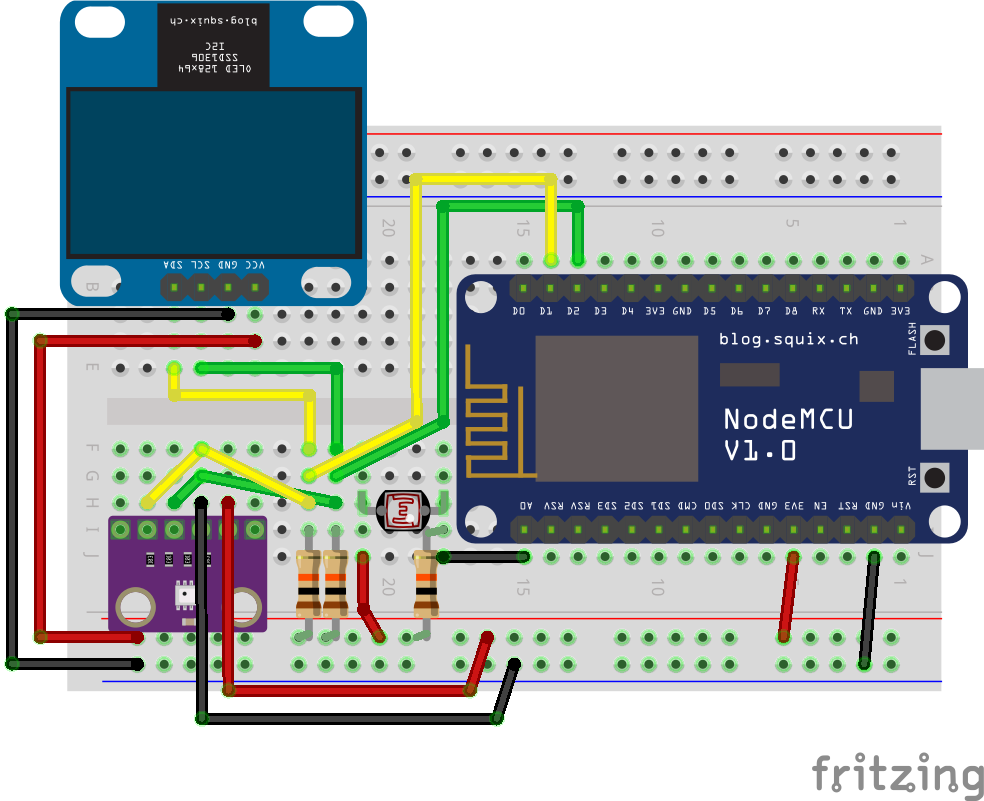

# sump-thing

## Parts

* 1x NodeMCU (ESP8266): http://a.co/d/fYVz4CV
* 1x BME280, temperature sensor: http://a.co/d/dGsapW6
* 1x SSD1306, 0.96" i2C OLED: http://a.co/d/9HEjrm8
* 1x Light sensitive resitor: http://a.co/d/9iC4TZW 
* 3x 10k resistors


## Wiring




## Installing micropython on NodeMCU

1. Downlaod the firmware
```
wget http://micropython.org/resources/firmware/esp8266-20180511-v1.9.4.bin
```

2. Wipe the ESP8266
```
esptool.py --port /dev/ttyUSB0 erase_flash
```

3. Install mircopython
```
esptool.py --port /dev/ttyUSB0 --baud 460800 write_flash --flash_size=detect 0 esp8266-20180511-v1.9.4.bin
```

4. Install python tools.
```
pipenv install
```


## Configuration

Copy `config.json.dist` to `config.json` and then edit it.


## Upload scripts to NodeMCU

I use `ampy` to *upload* the scripts to the ESP8266 which is all in the
`upload.sh` script.


## Testing

```
pipenv run mpfshell -o ttyUSB0
mpfs [/]> repl
```
